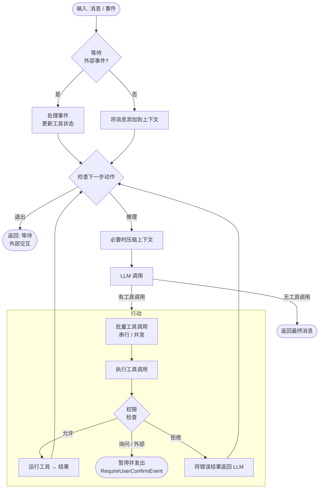

> ## Documentation Index
> Fetch the complete documentation index at: https://docs.agentscope.io/llms.txt
> Use this file to discover all available pages before exploring further.

# 智能体

> 了解如何在 AgentScope v2.0 中定义和配置智能体

## 概述

`Agent` 是 AgentScope 的核心抽象——一个**无状态**的推理-行动循环引擎，将模型、工具、权限系统、人机交互、上下文管理、中间件、状态管理和事件系统整合到一个统一接口中。

其主要职责包括：

* 接收输入消息或事件，调用工具完成任务
* 管理上下文，包括上下文压缩和工具结果卸载
* 在关键生命周期阶段提供中间件钩子，支持自定义逻辑
* 自动管理并发和串行工具执行

### 核心接口

`Agent` 类的主要接口如下：

| 方法                                 | 描述                                   |
| ---------------------------------- | ------------------------------------ |
| `reply(inputs)`                    | 运行推理-行动循环，返回最终 `Msg`                 |
| `reply_stream(inputs)`             | 同 `reply`，但以流式方式逐一产出 `AgentEvent` 对象 |
| `observe(msgs)`                    | 将消息添加到上下文，不触发推理                      |
| `compress_context(context_config)` | 在 token 数量超过阈值时压缩上下文                 |

### 主循环

智能体在每次 `reply` 调用时运行推理-行动循环，下图展示了主要控制流程：



## 配置智能体

在初始化时将参数传入 `Agent(...)`，以下示例涵盖最常见的几种配置场景。

<CodeGroup>
  ```python 最简配置 theme={null}
  from agentscope import Agent
  from agentscope.model import DashScopeChatModel
  from agentscope.credential import DashScopeCredential

  agent = Agent(
      name="my_agent",
      system_prompt="你是一个有帮助的助手。",
      model=DashScopeChatModel(
          credential=DashScopeCredential(api_key="YOUR_API_KEY"),
          model="qwen-max",
      ),
  )
  ```

  ```python 配置工具 / MCP / 技能 theme={null}
  import os
  from agentscope import Agent
  from agentscope.tool import Toolkit, Bash, Edit, Grep, Read, Write
  from agentscope.mcp import MCPClient, HttpMCPConfig
  from agentscope.model import DashScopeChatModel
  from agentscope.credential import DashScopeCredential

  agent = Agent(
      name="my_agent",
      system_prompt="你是一个有帮助的助手。",
      model=DashScopeChatModel(
          credential=DashScopeCredential(api_key="YOUR_API_KEY"),
          model="qwen-max",
      ),
      toolkit=Toolkit(
          tools=[Bash(), Edit(), Grep(), Read(), Write()],
          mcps=[
              MCPClient(
                  name="amap",
                  is_stateful=False,
                  mcp_config=HttpMCPConfig(
                      url=f"https://mcp.amap.com/mcp?key={os.environ['AMAP_API_KEY']}",
                  ),
              ),
          ],
          skills_or_loaders=["./skills"],
      ),
  )
  ```

  ```python 自定义上下文配置 theme={null}
  from agentscope import Agent
  from agentscope.agent import ContextConfig
  from agentscope.model import DashScopeChatModel
  from agentscope.credential import DashScopeCredential

  agent = Agent(
      name="my_agent",
      system_prompt="你是一个有帮助的助手。",
      model=DashScopeChatModel(
          credential=DashScopeCredential(api_key="YOUR_API_KEY"),
          model="qwen-max",
      ),
      context_config=ContextConfig(
          trigger_ratio=0.7,       # 使用 70% 上下文时触发压缩
          reserve_ratio=0.2,       # 压缩后保留最近 20% 的内容
          tool_result_limit=1000,  # 工具结果超过 1000 token 时截断
      ),
  )
  ```
</CodeGroup>

### 参数说明

| 参数               | 类型                             | 默认值    | 描述                                                       |
| ---------------- | ------------------------------ | ------ | -------------------------------------------------------- |
| `name`           | `str`                          | 必填     | 智能体标识符，用于消息和日志                                           |
| `system_prompt`  | `str`                          | 必填     | 智能体的基础系统提示词                                              |
| `model`          | `ChatModelBase`                | 必填     | 用于推理的大语言模型                                               |
| `toolkit`        | `Toolkit \| None`              | `None` | 管理工具、MCP 客户端、技能和工具组                                      |
| `state`          | `AgentState \| None`           | 自动创建   | 保存上下文、权限上下文和会话状态                                         |
| `offloader`      | `Offloader \| None`            | `None` | 用于压缩上下文和工具结果的卸载器，需实现 `Offloader` 协议                      |
| `middlewares`    | `list[MiddlewareBase] \| None` | `None` | 应用于 reply、reasoning、acting、model call 和 system prompt 钩子 |
| `model_config`   | `ModelConfig`                  | 默认值    | 重试次数和备用模型                                                |
| `context_config` | `ContextConfig`                | 默认值    | 上下文压缩阈值和工具结果长度限制                                         |
| `react_config`   | `ReActConfig`                  | 默认值    | 最大迭代次数和拒绝处理方式                                            |

## 运行智能体

`reply` 和 `reply_stream` 都接受相同的 `inputs` 参数，驱动相同的推理-行动循环，区别在于结果的交付方式。

`inputs` 参数支持：

* 单个 `Msg` 或 `Msg` 列表——开始新的 reply
* `UserConfirmResultEvent` 或 `ExternalExecutionResultEvent`——从暂停状态恢复
* `None`——不输入新内容，从当前状态继续

### reply

`reply` 在内部消费所有事件，当智能体完成或因外部交互暂停时返回最终 `Msg`。

```python theme={null}
import asyncio
from agentscope.message import UserMsg

async def main():
    msg = UserMsg(name="user", content="当前目录有哪些文件？")
    result = await agent.reply(msg)
    print(result.get_text())

asyncio.run(main())
```

### reply\_stream

`reply_stream` 逐一产出 `AgentEvent` 对象，让你实时将文本输出、工具调用进度和生命周期事件流式传输给用户。

```python theme={null}
async def main():
    msg = UserMsg(name="user", content="总结一下 README 的内容。")
    async for event in agent.reply_stream(msg):
        if hasattr(event, "delta"):
            print(event.delta, end="", flush=True)

asyncio.run(main())
```

### observe

使用 `observe` 将消息注入智能体上下文而不触发 reply——适用于多智能体场景中，一个智能体需要观察另一个智能体输出的情况。

```python theme={null}
await agent.observe(other_agent_msg)
```

## 压缩上下文

当 token 数量超过 `context_config.trigger_ratio × model.context_length` 时，智能体会自动压缩上下文。压缩会对较旧的消息进行摘要，如果配置了 `offloader`，还会将其卸载到磁盘。

也可以手动触发压缩：

```python theme={null}
from agentscope.agent import ContextConfig

# 使用智能体的默认配置
await agent.compress_context()

# 或为本次调用传入自定义配置
await agent.compress_context(
    ContextConfig(trigger_ratio=0.6, reserve_ratio=0.2)
)
```

<Note>
  如果系统提示词本身就超过了压缩阈值，`compress_context` 会抛出 `RuntimeError`。请保持系统提示词简洁，或增大模型的上下文长度。
</Note>

超过 `tool_result_limit` token 的工具结果会被自动截断。如果设置了 `offloader`，截断的部分会被卸载，智能体会收到一个可按需读取的路径引用。

## 人机交互

当智能体遇到以下两种情况时，会暂停执行并发出特殊事件：需要**用户确认**的工具调用（权限系统返回 ASK），或标记为**外部执行**的工具（结果必须来自智能体外部）。两种情况下，都可以通过向 `reply` 传入结果事件来恢复智能体。

### 用户确认

当权限系统判断某个工具调用需要用户批准时，智能体会发出 `RequireUserConfirmEvent` 并暂停。

<Steps>
  <Step title="接收 RequireUserConfirmEvent">
    使用 `reply_stream` 检测暂停。事件结构如下：

    <ParamField path="reply_id" type="str" required>
      当前 reply 的 ID，用于恢复智能体。
    </ParamField>

    <ParamField path="tool_calls" type="list[ToolCallBlock]" required>
      等待用户确认的工具调用列表。每个 `ToolCallBlock` 包含：

      <Expandable>
        <ParamField path="id" type="str">此工具调用的唯一标识符。</ParamField>
        <ParamField path="name" type="str">工具名称（如 `"Bash"`、`"Write"`）。</ParamField>
        <ParamField path="input" type="str">JSON 编码的输入参数。</ParamField>
        <ParamField path="suggested_rules" type="list[PermissionRule]">自动生成的权限规则，用户可接受以允许类似的未来调用。</ParamField>
      </Expandable>
    </ParamField>

    ```python theme={null}
    from agentscope.event import RequireUserConfirmEvent

    async for event in agent.reply_stream(msg):
        if isinstance(event, RequireUserConfirmEvent):
            for tc in event.tool_calls:
                print(f"工具: {tc.name}, 输入: {tc.input}")
                print(f"建议规则: {tc.suggested_rules}")
    ```
  </Step>

  <Step title="构建确认结果">
    为每个待处理的工具调用创建 `ConfirmResult`，指明是否允许执行。也可以修改工具调用输入或接受建议的权限规则：

    ```python theme={null}
    from agentscope.event import ConfirmResult, UserConfirmResultEvent

    confirm_results = []
    for tc in event.tool_calls:
        confirm_results.append(ConfirmResult(
            confirmed=True,           # 或 False 表示拒绝
            tool_call=tc,             # 传回（可选择修改）
            rules=tc.suggested_rules, # 接受规则以便未来自动允许
        ))
    ```
  </Step>

  <Step title="恢复智能体">
    将 `UserConfirmResultEvent` 传回 `reply` 或 `reply_stream`：

    ```python theme={null}
    confirm_event = UserConfirmResultEvent(
        reply_id=event.reply_id,
        confirm_results=confirm_results,
    )
    result = await agent.reply(confirm_event)
    ```

    * **已确认**的工具调用立即执行，智能体继续推理
    * **已拒绝**的工具调用会产生 LLM 可见的错误结果，LLM 可能会用不同方式重试
    * **已接受的规则**会持久化到权限引擎中——匹配的未来调用将自动允许，无需再次提示
  </Step>
</Steps>

### 外部工具执行

当智能体调用 `is_external_tool = True` 的工具时，会发出 `RequireExternalExecutionEvent` 并暂停。工具的逻辑在智能体外部运行——通常由人工操作员或外部系统执行。

<Steps>
  <Step title="接收 RequireExternalExecutionEvent">
    事件结构如下：

    <ParamField path="reply_id" type="str" required>
      当前 reply 的 ID，用于恢复智能体。
    </ParamField>

    <ParamField path="tool_calls" type="list[ToolCallBlock]" required>
      需要外部执行的工具调用列表。每个 `ToolCallBlock` 包含：

      <Expandable>
        <ParamField path="id" type="str">此工具调用的唯一标识符。</ParamField>
        <ParamField path="name" type="str">外部工具名称。</ParamField>
        <ParamField path="input" type="str">JSON 编码的输入参数。</ParamField>
      </Expandable>
    </ParamField>

    ```python theme={null}
    from agentscope.event import RequireExternalExecutionEvent

    async for event in agent.reply_stream(msg):
        if isinstance(event, RequireExternalExecutionEvent):
            for tc in event.tool_calls:
                print(f"外部执行: {tc.name}({tc.input})")
    ```
  </Step>

  <Step title="外部执行并构建结果">
    在智能体外部执行操作，并将结果封装为 `ToolResultBlock` 对象：

    ```python theme={null}
    from agentscope.message import ToolResultBlock, TextBlock, ToolResultState
    from agentscope.event import ExternalExecutionResultEvent

    execution_results = []
    for tc in event.tool_calls:
        # 执行实际操作（API 调用、人工操作等）
        output = await run_external_operation(tc.name, tc.input)

        execution_results.append(ToolResultBlock(
            id=tc.id,
            name=tc.name,
            output=[TextBlock(text=output)],
            state=ToolResultState.SUCCESS,
        ))
    ```
  </Step>

  <Step title="恢复智能体">
    传回 `ExternalExecutionResultEvent` 以恢复智能体：

    ```python theme={null}
    external_event = ExternalExecutionResultEvent(
        reply_id=event.reply_id,
        execution_results=execution_results,
    )
    result = await agent.reply(external_event)
    ```

    结果会被注入智能体上下文，推理从中断处继续。
  </Step>
</Steps>

<Tip>
  构建交互式 UI 时使用 `reply_stream`——它可以实时检测暂停事件并立即提示用户。以编程方式处理事件的自动化流程则使用 `reply`。
</Tip>

## 持久化智能体状态

`AgentState` 是一个 Pydantic 模型，保存了恢复智能体所需的全部信息——对话上下文、压缩摘要、权限规则、工具状态和当前 reply 位置。由于它是标准的 Pydantic 模型，可以序列化为 JSON 并存储在任意后端。

`RedisStorage` 是内置的存储后端，以 `(user_id, agent_id, session_id)` 为键层级组织状态，并提供两个面向热路径的方法：

| 方法                                                           | 描述                                                 |
| ------------------------------------------------------------ | -------------------------------------------------- |
| `get_session(user_id, agent_id, session_id)`                 | 加载 `SessionRecord`，其 `.state` 字段即为保存的 `AgentState` |
| `update_session_state(user_id, agent_id, session_id, state)` | 在 reply 结束后将更新后的 `AgentState` 持久化回 Redis           |

```python theme={null}
import asyncio
from agentscope import Agent
from agentscope.state import AgentState
from agentscope.model import DashScopeChatModel
from agentscope.credential import DashScopeCredential
from agentscope.message import UserMsg
from agentscope.app.storage import RedisStorage

USER_ID = "user_123"
AGENT_ID = "agent_456"
SESSION_ID = "session_789"

async def main():
    async with RedisStorage(host="localhost", port=6379) as storage:
        # 从存储中加载状态，若不存在则使用全新状态
        record = await storage.get_session(
            user_id=USER_ID,
            agent_id=AGENT_ID,
            session_id=SESSION_ID,
        )
        state = record.state if record else AgentState()

        # 使用恢复的状态创建智能体
        agent = Agent(
            name="my_agent",
            system_prompt="你是一个有帮助的助手。",
            model=DashScopeChatModel(
                credential=DashScopeCredential(api_key="YOUR_API_KEY"),
                model="qwen-max",
            ),
            state=state,
        )

        # 执行一轮 reply
        result = await agent.reply(
            UserMsg(name="user", content="继续之前的任务。"),
        )
        print(result.get_text())

        # 将更新后的状态持久化回 Redis
        await storage.update_session_state(
            user_id=USER_ID,
            agent_id=AGENT_ID,
            session_id=SESSION_ID,
            state=agent.state,
        )

asyncio.run(main())
```

<Note>
  若 session 尚不存在，`update_session_state` 会抛出 `KeyError`。首次创建时请使用 `upsert_session` 建立 session 记录，后续轮次再切换为 `update_session_state`。
</Note>

## 延伸阅读

<CardGroup cols={2}>
  <Card title="权限系统" href="/zh/v2/building-blocks/permission-system">
    控制智能体可以调用哪些工具以及在什么条件下调用。
  </Card>

  <Card title="中间件" href="/zh/v2/building-blocks/middleware">
    在 reply、reasoning、acting 和 model call 钩子处拦截和修改智能体行为。
  </Card>
</CardGroup>
