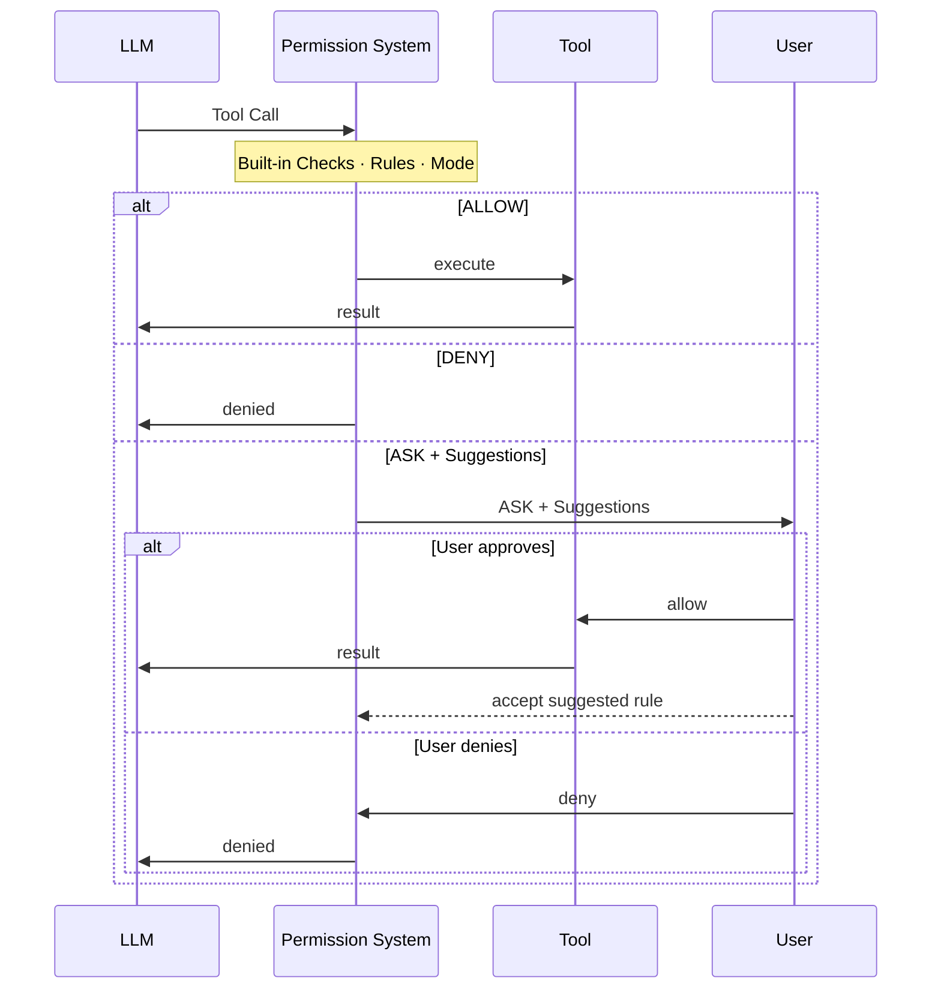

> ## Documentation Index
> Fetch the complete documentation index at: https://docs.agentscope.io/llms.txt
> Use this file to discover all available pages before exploring further.

# Permission System

> 精细控制 agent 可以执行哪些 tool、何时执行

## 概述

Permission system 拦截 agent 的每一次工具调用，给出三种决策之一：**允许（allow）** 执行、**拒绝（deny）** 执行，或者**询问用户（ask）** 确认。

它把静态配置与动态运行时分析组合起来。三个组件共同决定结果：

* **Rules** —— 针对每个 tool 与命令的显式 allow / deny / ask 模式，最高优先级。规则有两种来源：在 `PermissionContext` 中静态预配置，或在 ASK 提示中由用户接受**建议规则**而动态加入。建议规则由本次工具调用自动生成 —— 一旦接受，将来相同的调用便会被自动处理，不再询问。
* **Mode** —— 配置阶段设定的全局静态策略；决定所有不命中任何规则的调用的默认行为（例如 `EXPLORE` 让 agent 进入只读；`DONT_ASK` 静默拒绝未命中的调用）。
* **Built-in Checks** —— 由 tool 自身在运行时基于真实输入做的动态分析：只读命令检测（在调用时解析 bash 命令）、危险路径保护（检查实际文件路径或命令目标）。这些是运行时检查而非预配置模式，因此**不可绕过**，不受 mode 或 rules 覆盖。



<AccordionGroup>
  <Accordion title="详细决策流程">
    ```mermaid theme={null}
    flowchart TD
        A([Tool Call]) --> B{Deny Rules?}
        B -->|Match| DENY([DENY])
        B -->|No Match| C{Ask Rules?}
        C -->|Match| ASK1([ASK])
        C -->|No Match| D{Tool-Specific Checks}
        D -->|EXPLORE + write op| DENY
        D -->|Dangerous path| ASK2([ASK])
        D -->|Pass| E{Allow Rules?}
        E -->|Match| ALLOW([ALLOW])
        E -->|No Match| F{"ACCEPT_EDITS + safe file op?"}
        F -->|Yes| ALLOW
        F -->|No| G{"Read-only Bash command?"}
        G -->|Yes| ALLOW
        G -->|No| H{BYPASS mode?}
        H -->|Yes| ALLOW
        H -->|No| I{DONT_ASK mode?}
        I -->|Yes| DENY
        I -->|No| ASK3([ASK])
        ASK1 --> S[Generate Suggestions]
        ASK2 --> S
        ASK3 --> S
        S --> U{User Confirms?}
        U -->|Approve| ALLOW
        U -->|Deny| DENY
        U -->|Apply Rule| R[Update Context] --> ALLOW
        style DENY fill:#ff6b6b,color:#fff
        style ALLOW fill:#51cf66,color:#fff
        style ASK1 fill:#ffd43b,color:#333
        style ASK2 fill:#ffd43b,color:#333
        style ASK3 fill:#ffd43b,color:#333
    ```
  </Accordion>
</AccordionGroup>

<Note>
  Deny 规则与危险路径检查是**不可绕过的** —— 即使在 `BYPASS` 模式下也照常生效。
</Note>

## Permission Mode

AgentScope 支持以下模式，分别适配不同的部署场景：

| Mode           | 行为                     | 适用场景        |
| -------------- | ---------------------- | ----------- |
| `DEFAULT`      | 所有操作都需要显式规则或用户确认       | 最安全，推荐默认值   |
| `ACCEPT_EDITS` | 自动放行工作目录内的文件操作         | 用户在场的活跃开发   |
| `EXPLORE`      | 只读：放行读、拒绝所有写与命令        | 代码探索、规划     |
| `BYPASS`       | 放行一切（deny / ask 规则仍生效） | 完全可信的沙箱     |
| `DONT_ASK`     | 把所有 ASK 转为 DENY        | 无人值守 / 计划任务 |

可以在创建 agent 时通过 `AgentState.permission_context` 设置 mode，也可以在运行时更新：

<CodeGroup>
  ```python 初始化时配置 theme={null}
  from agentscope import Agent
  from agentscope.state import AgentState
  from agentscope.permission import PermissionContext, PermissionMode

  agent = Agent(
      name="my_agent",
      system_prompt="...",
      model=model,
      state=AgentState(
          permission_context=PermissionContext(
              mode=PermissionMode.DEFAULT,
          )
      ),
  )
  ```

  ```python 运行时切换 theme={null}
  # 切换到只读模式
  agent.state.permission_context.mode = PermissionMode.EXPLORE

  # 切换到无人值守模式以执行批处理
  agent.state.permission_context.mode = PermissionMode.DONT_ASK
  ```

  ```python ACCEPT_EDITS 配合工作目录 theme={null}
  from agentscope.permission import AdditionalWorkingDirectory

  agent = Agent(
      name="my_agent",
      system_prompt="...",
      model=model,
      state=AgentState(
          permission_context=PermissionContext(
              mode=PermissionMode.ACCEPT_EDITS,
              working_directories={
                  "/my/project": AdditionalWorkingDirectory(
                      path="/my/project",
                      source="userSettings",
                  )
              },
          )
      ),
  )
  ```
</CodeGroup>

## Permission Rule

`PermissionRule` 把某个 tool 与具体的调用模式映射到三种行为之一：`ALLOW`、`DENY`、`ASK`。

每条规则由下述字段组成。当权限引擎评估一条规则时，它会用 `rule_content` 与实际调用入参调用该 tool 的 `match_rule()` 方法，判断规则是否命中。

<ParamField path="tool_name" type="str" required>
  规则适用的 tool 名：`"Bash"`、`"Read"`、`"Write"`、`"Edit"`，或任意自定义 tool 名。
</ParamField>

<ParamField path="rule_content" type="str | None" required>
  匹配模式 —— 语义随 `tool_name` 变化：

  * **Bash**：通配前缀模式（`npm run:*` 命中 `npm run build`、`npm run test`）
  * **Read / Write / Edit**：glob 模式（`src/**/*.py` 命中 `src/` 下任意 `.py`）
  * **其他 tool**：对 JSON 序列化后的参数做精确匹配
</ParamField>

<ParamField path="behavior" type="PermissionBehavior" required>
  `ALLOW`、`DENY` 或 `ASK`
</ParamField>

<ParamField path="source" type="str" required>
  规则来源：`"userSettings"`、`"projectSettings"`、`"session"` 等。
</ParamField>

### 模式示例

`rule_content` 由各 tool 的 `match_rule()` 方法消费，并由 `ToolBase.generate_suggestions()` 自动生成。由于这两个方法都属于 tool 接口的一部分，每个 tool 可以独立定义自己的模式语法与匹配逻辑。

AgentScope 内置工具的模式约定如下：

<Tabs>
  <Tab title="Bash">
    针对 **`command`** 参数做匹配。模式格式为 `COMMAND_PREFIX:*` —— 前缀是命令的首段 token，`*` 匹配后续任意参数。

    | 模式             | 匹配                             | 不匹配           |
    | -------------- | ------------------------------ | ------------- |
    | `npm run:*`    | `npm run build`、`npm run test` | `npm install` |
    | `git commit:*` | `git commit -m "fix"`          | `git push`    |
    | `rm:*`         | `rm file.txt`、`rm -rf /tmp/x`  | `ls`          |

    ```python theme={null}
    PermissionRule(
        tool_name="Bash",
        rule_content="npm run:*",
        behavior=PermissionBehavior.ALLOW,
        source="userSettings",
    )
    ```
  </Tab>

  <Tab title="文件类工具（Read / Write / Edit）">
    针对 **`file_path`** 参数，通过 `fnmatch` 做 glob 匹配。

    | 模式            | 匹配                  |
    | ------------- | ------------------- |
    | `src/**`      | `src/` 下任意文件        |
    | `src/**/*.py` | `src/` 下的 Python 文件 |
    | `config.json` | 精确匹配该文件             |

    ```python theme={null}
    PermissionRule(
        tool_name="Write",
        rule_content="src/**",
        behavior=PermissionBehavior.ALLOW,
        source="userSettings",
    )
    ```
  </Tab>
</Tabs>

### 配置规则

**初始化时** —— 在创建 agent 时把规则传入 `PermissionContext`：

```python theme={null}
from agentscope import Agent
from agentscope.state import AgentState
from agentscope.permission import (
    PermissionContext, PermissionMode, PermissionRule, PermissionBehavior
)

agent = Agent(
    name="my_agent",
    system_prompt="...",
    model=model,
    state=AgentState(
        permission_context=PermissionContext(
            mode=PermissionMode.DEFAULT,
            allow_rules={
                "Bash": [PermissionRule(tool_name="Bash", rule_content="npm run:*",
                                        behavior=PermissionBehavior.ALLOW, source="userSettings")],
                "Write": [PermissionRule(tool_name="Write", rule_content="src/**",
                                         behavior=PermissionBehavior.ALLOW, source="userSettings")],
            },
            deny_rules={
                "Bash": [PermissionRule(tool_name="Bash", rule_content="rm:*",
                                        behavior=PermissionBehavior.DENY, source="userSettings")],
            },
        )
    ),
)
```

**运行时通过建议规则** —— 当权限系统返回 ASK 时，会基于本次调用自动生成建议规则。把已接受的规则附在 `UserConfirmResultEvent.rules` 中回传，agent 会自动写入引擎：

```python theme={null}
from agentscope.event import UserConfirmResultEvent

# ASK 决策中包含基于本次调用生成的 suggested_rules。
# 接受建议时，把它放入结果事件即可：
result = UserConfirmResultEvent(
    confirmed=True,
    rules=[suggested_rule],  # 已接受的规则会被持久化进引擎
)
```

## Built-in Checks

每个 tool 都实现了一个 `check_permissions()` 方法，在运行时基于真实调用入参执行检查。这些检查不可绕过 —— 无论 mode 或 rules 是什么，它们都生效。AgentScope 内置工具覆盖三类检查：

* **危险路径保护** —— `Write`、`Edit`、`Bash` 检查目标文件或命令是否触及敏感路径。即使在 `BYPASS` 模式下也始终触发 ASK。
* **只读命令检测** —— `Bash` 解析命令字符串识别只读操作，自动放行。
* **ACCEPT\_EDITS 模式** —— `Write` 与 `Edit` 自动放行已配置工作目录内的文件操作。

自定义 tool 可以重写 `check_permissions()` 实现自己的检查逻辑：

```python theme={null}
from agentscope.tool import ToolBase
from agentscope.permission import PermissionContext, PermissionDecision, PermissionBehavior

class MyTool(ToolBase):
    name = "MyTool"
    is_read_only = False

    async def check_permissions(
        self,
        tool_input: dict,
        context: PermissionContext,
    ) -> PermissionDecision:
        target = tool_input.get("target")

        # 自定义安全检查：阻止操作生产资源
        if target and target.startswith("prod-"):
            return PermissionDecision(
                behavior=PermissionBehavior.ASK,
                message=f"Operation targets production resource: {target}",
            )

        # 返回 PASSTHROUGH 让引擎继续按 rules / mode 评估
        return PermissionDecision(behavior=PermissionBehavior.PASSTHROUGH)
```

### 只读命令

常见的只读 bash 命令在没有任何规则的情况下也会被自动放行。复合命令（`&&`、`||`、`;`、`|`）只有在**所有**子命令都只读时才视为只读。输出重定向（`>`、`>>`）会让命令立即失去只读属性。

<AccordionGroup>
  <Accordion title="完整只读命令列表">
    | 类别         | 命令                                                                                                                |
    | ---------- | ----------------------------------------------------------------------------------------------------------------- |
    | Git        | `git status`、`git log`、`git diff`、`git show`、`git branch`、`git blame`、`git grep`、`git reflog`、`git config --list` |
    | 文件         | `ls`、`cat`、`head`、`tail`、`grep`、`rg`、`find`、`tree`、`stat`、`wc`、`pwd`、`which`                                      |
    | Docker     | `docker ps`、`docker images`、`docker logs`、`docker inspect`、`docker info`                                          |
    | GitHub CLI | `gh repo view`、`gh issue list`、`gh pr list`、`gh status`                                                           |
    | 包管理器       | `npm list`、`pip list`、`pip show`、`node --version`、`python --version`                                              |
  </Accordion>
</AccordionGroup>

### 危险路径保护

<Warning>
  针对以下路径的操作始终触发 ASK，即使在 `BYPASS` 模式下也是如此。
</Warning>

| 类别       | 路径                                                         |
| -------- | ---------------------------------------------------------- |
| Shell 配置 | `.bashrc`、`.zshrc`、`.bash_profile`、`.profile`              |
| Git 配置   | `.gitconfig`、`.gitmodules`                                 |
| SSH      | `.ssh/config`、`.ssh/authorized_keys`、`id_rsa`、`id_ed25519` |
| 凭证       | `.env`、`.env.local`、`.npmrc`、`.pypirc`、`.aws/credentials`  |
| 目录       | `.git/`、`.ssh/`、`.claude/`、`.vscode/`、`.aws/`、`.kube/`     |

## 常见配方

下面的示例展示了如何为常见部署场景配置 `AgentState.permission_context`。每个配方把一种 mode 与一组规则结合，匹配特定的使用场景。

<CodeGroup>
  ```python 只读探索 theme={null}
  # EXPLORE 模式：agent 可以自由 read / grep / glob，
  # 所有写操作与 bash 命令都会被自动拒绝。
  agent = Agent(
      name="explorer",
      system_prompt="...",
      model=model,
      state=AgentState(
          permission_context=PermissionContext(mode=PermissionMode.EXPLORE)
      ),
  )
  # Agent 可以自由 read / grep / glob；所有写与 bash 命令均被拒绝
  ```

  ```python 无人值守自动化 theme={null}
  from agentscope.permission import PermissionRule, PermissionBehavior

  agent = Agent(
      name="ci_agent",
      system_prompt="...",
      model=model,
      state=AgentState(
          permission_context=PermissionContext(
              mode=PermissionMode.DONT_ASK,
              allow_rules={
                  "Bash": [
                      PermissionRule(tool_name="Bash", rule_content="npm run:*",
                                     behavior=PermissionBehavior.ALLOW, source="project"),
                      PermissionRule(tool_name="Bash", rule_content="git commit:*",
                                     behavior=PermissionBehavior.ALLOW, source="project"),
                  ],
              },
          )
      ),
  )
  # 只有显式放行的命令会执行；其余调用被静默拒绝
  ```

  ```python 阻止危险命令 theme={null}
  agent = Agent(
      name="my_agent",
      system_prompt="...",
      model=model,
      state=AgentState(
          permission_context=PermissionContext(
              mode=PermissionMode.BYPASS,
              deny_rules={
                  "Bash": [
                      PermissionRule(tool_name="Bash", rule_content="rm:*",
                                     behavior=PermissionBehavior.DENY, source="userSettings"),
                      PermissionRule(tool_name="Bash", rule_content="git push:*",
                                     behavior=PermissionBehavior.DENY, source="userSettings"),
                  ],
              },
          )
      ),
  )
  # 除 rm 与 git push 外其余均放行（deny 规则不可绕过）
  ```
</CodeGroup>
