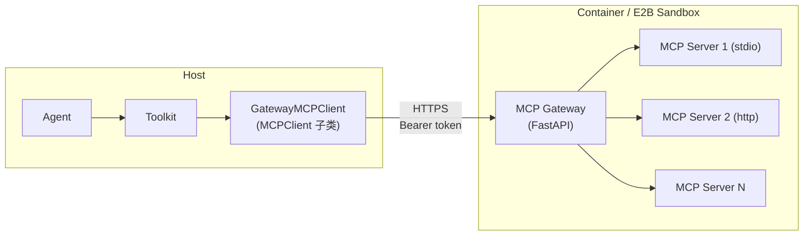

> ## Documentation Index
> Fetch the complete documentation index at: https://docs.agentscope.io/llms.txt
> Use this file to discover all available pages before exploring further.

# Workspace

> 为 agent 提供工具、skill 与上下文 offload 的执行环境

## 概述

Workspace 是 agent 的执行环境，向 agent 提供三类资源 —— **工具**（内置 tool 与 MCP）、**skill**，以及面向压缩消息与超大工具结果的**上下文 offload** —— 同时管理其中资源（MCP server 进程、动态加入的 skill、offload 文件）的生命周期。

AgentScope 提供三种 workspace 实现 —— 本地文件系统、Docker 容器、E2B 云沙箱 —— 以及一个 **workspace manager**，在 [Agent Service](/zh/v2/deploy/agent-service) 中负责分配和追踪 workspace，让多租户部署可以把 workspace 按 user、agent 或 session 维度映射，无需改写 agent 代码。

对 Docker 与 E2B 而言，MCP server 跑在隔离环境*内部*；宿主侧通过 workspace 内的 gateway 访问它们，详见后文 [MCP Gateway](#mcp-gateway)。

## 使用 Workspace

### 创建 Workspace

AgentScope 针对三种执行后端提供了对应的 workspace 实现：

| 类                 | 后端                          |
| ----------------- | --------------------------- |
| `LocalWorkspace`  | 宿主文件系统（内置 tool 直接在宿主侧运行）    |
| `DockerWorkspace` | 基于 `aiodocker` 的 Docker 容器  |
| `E2BWorkspace`    | 基于 `AsyncSandbox` 的 E2B 云沙箱 |

每种后端的持久化方式与目录结构各不相同 —— 选择对应的 tab 查看：

<Tabs>
  <Tab title="LocalWorkspace">
    `LocalWorkspace` 直接把状态持久化在宿主文件系统的 `workdir` 下，重启时只需重新打开同一目录。目录结构如下：

    ```
    {workdir}/
    ├── .mcp           # 注册的 MCP client 配置（JSON 数组）
    ├── data/          # offload 的多模态负载（按 SHA-256 去重）
    ├── skills/        # skill 子目录，每个含 SKILL.md
    │   └── .skills    # 名称/哈希索引，用于去重
    └── sessions/      # 每个 session 的 context.jsonl 与工具结果文件
    ```

    ```python theme={null}
    from agentscope.workspace import LocalWorkspace

    workspace = LocalWorkspace(
        workdir="/data/my-workspace",
        default_mcps=[],
        skill_paths=["./skills/web-search"],
    )
    await workspace.initialize()
    ```
  </Tab>

  <Tab title="DockerWorkspace">
    `DockerWorkspace` 把宿主 `workdir` 挂载到容器内的 `/workspace`，因此下方目录结构存放在宿主侧，跨容器重启依旧保留。若不传 `workdir`，整套数据只活在容器的可写层中，容器销毁即消失。

    ```
    {workdir}/         # 宿主目录，挂载到容器内 /workspace
    ├── .mcp           # 注册的 MCP client 配置（JSON 数组）
    ├── data/          # offload 的多模态负载
    ├── skills/        # skill 子目录，每个含 SKILL.md
    └── sessions/      # 每个 session 的 context.jsonl 与工具结果文件
    ```

    ```python theme={null}
    from agentscope.workspace import DockerWorkspace

    workspace = DockerWorkspace(
        base_image="python:3.11-slim",
        workdir="/data/docker-workspaces/agent-1",  # 挂载到容器内 /workspace
        node_version="20",
        extra_pip=["numpy", "pandas"],
        default_mcps=[],
        skill_paths=["./skills/web-search"],
    )
    await workspace.initialize()
    ```
  </Tab>

  <Tab title="E2BWorkspace">
    `E2BWorkspace` 把沙箱文件系统本身作为持久化层，没有宿主 `workdir`。每个沙箱在 E2B metadata 中带有 `workspace_id`，重启时 manager 通过 `AsyncSandbox.list(...)` 找回它，并以 `connect(sandbox_id=...)` 重连；pause 时磁盘状态保留，resume 时原样恢复。

    ```
    $workdir/          # 位于沙箱内部
    ├── .mcp           # 注册的 MCP client 配置（JSON 数组）
    ├── data/          # offload 的多模态负载
    ├── skills/        # skill 子目录，每个含 SKILL.md
    └── sessions/      # 每个 session 的 context.jsonl 与工具结果文件
    ```

    ```python theme={null}
    from agentscope.workspace import E2BWorkspace

    workspace = E2BWorkspace(
        template="base",
        api_key="your-e2b-api-key",   # 或设置环境变量 E2B_API_KEY
        timeout_seconds=300,
        default_mcps=[],
        skill_paths=["./skills/web-search"],
    )
    await workspace.initialize()
    ```
  </Tab>
</Tabs>

`default_mcps` 与 `skill_paths` 是 seed-time 输入 —— 仅在全新 workspace 首次 `initialize()` 时生效。重启时 workspace 从持久化的 `.mcp` 文件中恢复 MCP 列表，重复传入这些 seed 不会产生影响。

三种实现共享同一份 `WorkspaceBase` 接口，因此同一份 agent 代码可以在任意后端上无差别运行。接口按使用角色分为四组：

<ParamField path="initialize() / close() / reset()" type="生命周期 (developer)">
  分配 / 释放 workspace，在归还到池前清空 per-session 状态；同时驱动 `async with` 协议。
</ParamField>

<ParamField path="list_tools() / list_mcps() / list_skills() / get_instructions()" type="资源发现 (agent)">
  列出内置 tool、活跃的 `MCPClient`、可用 skill，以及一段 workspace 专属的 system prompt 片段。
</ParamField>

<ParamField path="offload_context(session_id, msgs) / offload_tool_result(session_id, tool_result)" type="Offload (agent)">
  将压缩后的上下文或超大工具结果持久化到 `sessions/<session_id>/`，返回引用路径供 agent 替换原始负载。
</ParamField>

<ParamField path="add_mcp(mcp_client) / remove_mcp(name) / add_skill(skill_path) / remove_skill(name)" type="动态管理 (user)">
  运行时注册或移除 MCP server 与 skill，变更会写入 `.mcp` 与 `skills/`，跨重启保留。
</ParamField>

### 与 Agent 集成

Workspace 从两个角度接入 `Agent` —— 作为 tool / MCP / skill 的来源，以及作为上下文压缩的 offloader：

```python theme={null}
from agentscope import Agent
from agentscope.tool import Toolkit
from agentscope.workspace import LocalWorkspace

workspace = LocalWorkspace(workdir="./my-workspace")
await workspace.initialize()

agent = Agent(
    name="coder",
    system_prompt="You are a coding assistant.",
    model=model,
    toolkit=Toolkit(
        tools=await workspace.list_tools(),
        mcps=await workspace.list_mcps(),
        skills_or_loaders=await workspace.list_skills(),
    ),
    offloader=workspace,
)
```

| 角度      | 装配                                                    | Agent 拿到什么                                                                                           |
| ------- | ----------------------------------------------------- | ---------------------------------------------------------------------------------------------------- |
| 资源      | `Toolkit(tools=..., mcps=..., skills_or_loaders=...)` | workspace 中可用的内置 tool、MCP 提供的 tool 与 skill                                                           |
| Offload | `Agent(offloader=workspace)`                          | 上下文压缩触发或工具结果超过大小阈值时，agent 调用 `workspace.offload_context()` / `offload_tool_result()`，并用返回的引用路径替换原始负载 |

`Agent` 仅依赖 `Offloader` 协议（`offload_context` / `offload_tool_result`），任何满足该协议的对象都可以承担此角色 —— workspace 是典型实现。

<Tip>
  Workspace 把资源以扁平列表的方式暴露出来，因此当 agent 工具数量过多、不便全部常驻激活时，可以按主题切分到不同的 `ToolGroup`，作为 `Toolkit(tool_groups=[...])` 传入；agent 通过内置 meta-tool `ResetTools` 按需激活，只有保留名 `basic` 组始终在线。

  ```python theme={null}
  from agentscope.tool import Toolkit, ToolGroup

  mcps = await workspace.list_mcps()
  skills = await workspace.list_skills()

  toolkit = Toolkit(
      tools=await workspace.list_tools(),         # 始终激活（basic 组）
      tool_groups=[
          ToolGroup(name="search", description="Web 搜索与检索。",
                    mcps=[m for m in mcps if m.name.startswith("search")]),
          ToolGroup(name="coding", description="代码编辑相关 skill。",
                    skills_or_loaders=skills),
      ],
  )
  ```
</Tip>

## Workspace Manager

Workspace manager 是多租户服务中 workspace 的分配器与生命周期持有者，由 [Agent Service](/zh/v2/deploy/agent-service) 使用，负责把请求路由到正确的 workspace 实例并在关闭时回收。

Manager 的职责：

* **分配** —— `create_workspace(user_id, agent_id, session_id)` 构造新 workspace 并纳入追踪；`get_workspace(..., workspace_id)` 返回已存在的 workspace，缓存未命中时按需重建。
* **缓存与 TTL** —— 以 `workspace_id` 为键在内存中缓存 workspace；空闲超过 `ttl` 秒后淘汰，并销毁底层资源（容器、沙箱、MCP 进程）。
* **隔离策略** —— manager 决定两次请求是否共享同一 workspace；内置 manager 都按 `agent_id` 隔离，而 `WorkspaceManagerBase` 是个极小的抽象类，可继承后改写为按 user 或按 session 隔离。
* **回收** —— `close(workspace_id)` 淘汰单个条目，`close_all()` 在应用关闭时清空缓存。

AgentScope 提供三种 manager，分别配合一种 workspace 后端，全部按 agent 隔离：

| 类                        | 配套 workspace      | 隔离键                                                               | 缓存键            |
| ------------------------ | ----------------- | ----------------------------------------------------------------- | -------------- |
| `LocalWorkspaceManager`  | `LocalWorkspace`  | `agent_id`（workdir = `<basedir>/<agent_id>`）                      | `workspace_id` |
| `DockerWorkspaceManager` | `DockerWorkspace` | `(user_id, agent_id)`（workdir = `<basedir>/<user_id>/<agent_id>`） | `workspace_id` |
| `E2BWorkspaceManager`    | `E2BWorkspace`    | `agent_id`（沙箱 metadata，无宿主 workdir）                               | `workspace_id` |

构造 manager 后即可像 workspace 分配器一样使用：

```python theme={null}
from agentscope.app._manager import LocalWorkspaceManager

manager = LocalWorkspaceManager(
    basedir="/data/workspaces",
    skill_paths=["./skills/coding"],
    ttl=3600.0,
)

ws = await manager.create_workspace(
    user_id="user-1",
    agent_id="agent-42",
    session_id="session-abc",
)

# 后续请求复用同一 workspace：
ws = await manager.get_workspace(
    user_id="user-1",
    agent_id="agent-42",
    session_id="session-abc",
    workspace_id=ws.workspace_id,
)
```

要换用其他隔离策略（按 user、按 session 或混合），继承 `WorkspaceManagerBase` 并按自己的键重写 `get_workspace` / `create_workspace` —— 关于 manager 如何接入服务请求生命周期，详见 [Agent Service · Workspace 实现与隔离](/zh/v2/deploy/agent-service#workspace-实现与隔离)。

<Tip>
  Agent Service 在 lifespan 期间把 workspace manager 绑定到 FastAPI 应用状态上，所有请求共享；router 通过 `get_workspace_manager` 依赖注入获取 workspace。完整集成方式见 [Agent Service](/zh/v2/deploy/agent-service)。
</Tip>

## MCP Gateway

`DockerWorkspace` 与 `E2BWorkspace` 无法直接在宿主侧注册 MCP client —— MCP server 跑在容器或沙箱内部，stdio 会话也无法跨越该边界。AgentScope 用一套 **MCP gateway** 抽象解决此问题：在 workspace *内部*运行一个轻量 FastAPI 进程，它持有上游 MCP 会话，并通过单一带鉴权的 HTTP 端点对宿主暴露这些会话。



Gateway 暴露一组小型 REST 接口 —— `GET /health`、`GET/POST/DELETE /mcps`、`GET /mcps/{name}/tools`、`POST /mcps/{name}/tools/{tool}` —— 通过每次 `initialize()` 重新生成的 per-workspace bearer token 鉴权。宿主侧两个适配器保持标准接口不变：

* **`GatewayMCPClient`** —— `MCPClient` 子类，把 `connect` / `close` / `list_tools` 等调用替换为对 gateway 的 HTTP 请求，其它 toolkit 代码无法将它与本地 MCP client 区分开。
* **`GatewayMCPTool`** —— `ToolBase` 子类，`__call__` 直接 POST 到 `/mcps/{name}/tools/{tool}` 并重建返回的 `ToolChunk`。

正因这层抽象，agent 侧代码在三种 workspace 后端上完全一致 —— 无论上游 MCP 会话在宿主侧（`LocalWorkspace`）还是在隔离环境内（`DockerWorkspace` / `E2BWorkspace`），workspace 的 `list_mcps()` 都返回 `MCPClient` 实例。

## 延伸阅读

<CardGroup cols={2}>
  <Card title="Agent" icon="robot" href="/zh/v2/building-blocks/agent">
    Agent 抽象、ReAct 循环与 offloader 集成
  </Card>

  <Card title="Tool" icon="wrench" href="/zh/v2/building-blocks/tool">
    内置 tool、MCP 集成与 toolkit 组装
  </Card>

  <Card title="Agent Service" icon="server" href="/zh/v2/deploy/agent-service">
    驱动 workspace manager 的多租户服务
  </Card>

  <Card title="Context" icon="database" href="/zh/v2/building-blocks/context">
    上下文压缩与 offload 触发条件
  </Card>
</CardGroup>
