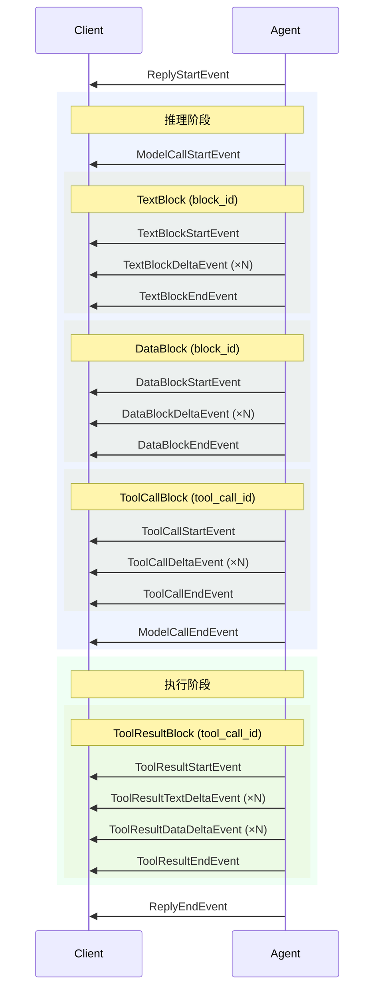

> ## Documentation Index
> Fetch the complete documentation index at: https://docs.agentscope.io/llms.txt
> Use this file to discover all available pages before exploring further.

# 消息与事件

> 智能体通信，与前端流式数据传输

消息（Message）与事件（Event）是 AgentScope 中两种基础数据结构。

* **消息** — 智能体间通信与持久化的基本单元。每个 `Msg` 代表一个完整的对话轮次，存储在上下文中并在智能体之间传递。
* **事件** — 前端交互与流式传输的基本单元。事件携带增量进度更新（文本 token、工具调用片段、权限请求等），驱动实时界面和人工介入工作流。

单次 `reply` 调用产生的事件序列最终汇聚成恰好一条 assistant `Msg`，这保证了完整的消息状态始终可以从事件流中还原。

## 消息

`Msg` 代表对话中的一个轮次——用户输入、智能体回复或系统指令，内容以有序的类型化块（block）列表表示。

<Tip>
  一条 assistant 消息对应智能体一次完整的 `reply` 周期（反复推理和执行，直到产出最终回复）。
</Tip>

### 结构

`Msg` 类的核心字段如下：

| 字段            | 类型                                  | 说明                         |
| ------------- | ----------------------------------- | -------------------------- |
| `id`          | `str`                               | 唯一消息标识符                    |
| `name`        | `str`                               | 发送方名称                      |
| `role`        | `"user" \| "assistant" \| "system"` | 发送方角色                      |
| `content`     | `list[ContentBlock]`                | 有序内容块列表                    |
| `metadata`    | `dict`                              | 任意键值元数据                    |
| `created_at`  | `str`                               | 创建时间（ISO 8601）             |
| `finished_at` | `str \| None`                       | 消息完成时间（ISO 8601）           |
| `usage`       | `Usage`                             | Token 用量统计（仅 assistant 消息） |

### 内容块

消息内容由类型化的块组成，每种块代表一类独立信息：

| 块类型               | 说明                           | 允许出现在                 |
| ----------------- | ---------------------------- | --------------------- |
| `TextBlock`       | 纯文本内容                        | user、assistant、system |
| `DataBlock`       | 二进制数据（图片、音频），通过 base64 或 URL | user、assistant        |
| `ThinkingBlock`   | 模型推理过程（思维链）                  | assistant             |
| `ToolCallBlock`   | 工具调用，包含名称、输入和状态              | assistant             |
| `ToolResultBlock` | 工具执行结果                       | assistant             |
| `HintBlock`       | 以用户上下文形式注入循环的指令              | assistant             |

<Note>
  角色约束在构造时强制执行：`user` 消息只能包含 `TextBlock` 和 `DataBlock`；`system` 消息只能包含 `TextBlock`；`assistant` 消息可包含所有块类型。
</Note>

### 创建消息

AgentScope 提供三个快捷工厂函数，无需手动指定 `role` 或手动包装内容块：

| 工厂函数                          | 角色          | 允许的 content                            |
| ----------------------------- | ----------- | -------------------------------------- |
| `UserMsg(name, content)`      | `user`      | `str` 或 `list[TextBlock \| DataBlock]` |
| `AssistantMsg(name, content)` | `assistant` | `str` 或 `list[ContentBlock]`           |
| `SystemMsg(name, content)`    | `system`    | `str` 或 `list[TextBlock]`              |

当 `content` 为普通字符串时，会自动包装为 `TextBlock`。

```python theme={null}
from agentscope.message import UserMsg, AssistantMsg, SystemMsg

# 用户消息 —— 文本及可选图片
user_msg = UserMsg(name="user", content="这张图片里有什么？")

# 多模态用户消息
from agentscope.message import TextBlock, DataBlock, Base64Source
user_msg = UserMsg(
    name="user",
    content=[
        TextBlock(text="描述这张图片："),
        DataBlock(source=Base64Source(data="...", media_type="image/png")),
    ],
)

# 系统消息 —— 仅文本
system_msg = SystemMsg(name="system", content="你是一个有用的助手。")

# 助手消息 —— 允许所有块类型
assistant_msg = AssistantMsg(name="agent", content="结果如下...")
```

### 访问内容

`Msg` 提供了一组辅助方法用于提取特定块类型：

| 方法                                 | 返回值                           |
| ---------------------------------- | ----------------------------- |
| `get_text_content(separator="\n")` | 所有 `TextBlock` 的拼接文本，或 `None` |
| `get_content_blocks(block_type)`   | 按类型过滤后的块列表                    |
| `has_content_blocks(block_type)`   | 若存在指定类型的块则返回 `True`           |

```python theme={null}
# 获取所有文本内容
text = msg.get_text_content()

# 获取所有工具调用
tool_calls = msg.get_content_blocks("tool_call")

# 检查消息是否包含工具结果
if msg.has_content_blocks("tool_result"):
    ...
```

## 事件

事件是消息的流式对应物。智能体执行过程中会持续产出一系列 `AgentEvent` 对象，表示增量进度——文本 token 到达、工具调用逐步构建、结果流式返回。每个事件都是轻量且自包含的。

### 事件生命周期

每个事件都携带 `reply_id`，将其关联到正在构建的消息。在一次回复中，`block_id` 或 `tool_call_id` 标识事件所属的内容块。事件遵循 **start → delta → end** 模式：



同一次回复中的所有事件共享相同的 `reply_id`。在回复内部，用 `block_id` 关联文本/思考/数据块事件，用 `tool_call_id` 关联工具调用和工具结果事件。

### 事件类型

所有事件继承自 `EventBase`，提供以下公共字段：

| 字段           | 类型    | 说明           |
| ------------ | ----- | ------------ |
| `id`         | `str` | 唯一事件标识符      |
| `created_at` | `str` | ISO 8601 时间戳 |

事件按类别分组如下。除特别说明外，每个事件还携带 `reply_id` 字段，关联到正在构建的消息。

<AccordionGroup>
  <Accordion title="生命周期事件">
    **ReplyStartEvent** — 智能体开始新的回复。

    | 字段           | 类型    | 说明                      |
    | ------------ | ----- | ----------------------- |
    | `reply_id`   | `str` | 回复消息 ID                 |
    | `session_id` | `str` | 会话 ID                   |
    | `name`       | `str` | 智能体名称                   |
    | `role`       | `str` | 智能体角色（默认 `"assistant"`） |

    **ReplyEndEvent** — 智能体完成回复。

    | 字段           | 类型    | 说明      |
    | ------------ | ----- | ------- |
    | `reply_id`   | `str` | 回复消息 ID |
    | `session_id` | `str` | 会话 ID   |

    **ExceedMaxItersEvent** — 智能体达到最大推理-执行迭代次数。

    | 字段         | 类型    | 说明      |
    | ---------- | ----- | ------- |
    | `reply_id` | `str` | 回复消息 ID |
    | `name`     | `str` | 智能体名称   |
  </Accordion>

  <Accordion title="文本流式事件">
    **TextBlockStartEvent** — 新的文本块开始。

    | 字段         | 类型    | 说明       |
    | ---------- | ----- | -------- |
    | `reply_id` | `str` | 回复消息 ID  |
    | `block_id` | `str` | 文本块唯一标识符 |

    **TextBlockDeltaEvent** — 增量文本内容到达。

    | 字段         | 类型    | 说明       |
    | ---------- | ----- | -------- |
    | `reply_id` | `str` | 回复消息 ID  |
    | `block_id` | `str` | 文本块唯一标识符 |
    | `delta`    | `str` | 增量文本内容   |

    **TextBlockEndEvent** — 文本块完成。

    | 字段         | 类型    | 说明       |
    | ---------- | ----- | -------- |
    | `reply_id` | `str` | 回复消息 ID  |
    | `block_id` | `str` | 文本块唯一标识符 |
  </Accordion>

  <Accordion title="思考流式事件">
    **ThinkingBlockStartEvent** — 新的思考块开始。

    | 字段         | 类型    | 说明       |
    | ---------- | ----- | -------- |
    | `reply_id` | `str` | 回复消息 ID  |
    | `block_id` | `str` | 思考块唯一标识符 |

    **ThinkingBlockDeltaEvent** — 增量思考内容到达。

    | 字段         | 类型    | 说明       |
    | ---------- | ----- | -------- |
    | `reply_id` | `str` | 回复消息 ID  |
    | `block_id` | `str` | 思考块唯一标识符 |
    | `delta`    | `str` | 增量思考文本   |

    **ThinkingBlockEndEvent** — 思考块完成。

    | 字段         | 类型    | 说明       |
    | ---------- | ----- | -------- |
    | `reply_id` | `str` | 回复消息 ID  |
    | `block_id` | `str` | 思考块唯一标识符 |
  </Accordion>

  <Accordion title="数据流式事件">
    **DataBlockStartEvent** — 新的数据块开始（图片、音频等）。

    | 字段           | 类型    | 说明                       |
    | ------------ | ----- | ------------------------ |
    | `reply_id`   | `str` | 回复消息 ID                  |
    | `block_id`   | `str` | 数据块唯一标识符                 |
    | `media_type` | `str` | MIME 类型（如 `"image/png"`） |

    **DataBlockDeltaEvent** — 增量二进制数据到达。

    | 字段           | 类型    | 说明             |
    | ------------ | ----- | -------------- |
    | `reply_id`   | `str` | 回复消息 ID        |
    | `block_id`   | `str` | 数据块唯一标识符       |
    | `data`       | `str` | 增量 base64 编码数据 |
    | `media_type` | `str` | MIME 类型        |

    **DataBlockEndEvent** — 数据块完成。

    | 字段         | 类型    | 说明       |
    | ---------- | ----- | -------- |
    | `reply_id` | `str` | 回复消息 ID  |
    | `block_id` | `str` | 数据块唯一标识符 |
  </Accordion>

  <Accordion title="工具调用流式事件">
    **ToolCallStartEvent** — 智能体开始一次工具调用。

    | 字段               | 类型    | 说明        |
    | ---------------- | ----- | --------- |
    | `reply_id`       | `str` | 回复消息 ID   |
    | `tool_call_id`   | `str` | 工具调用唯一标识符 |
    | `tool_call_name` | `str` | 被调用的工具名称  |

    **ToolCallDeltaEvent** — 增量工具调用参数到达。

    | 字段             | 类型    | 说明           |
    | -------------- | ----- | ------------ |
    | `reply_id`     | `str` | 回复消息 ID      |
    | `tool_call_id` | `str` | 工具调用唯一标识符    |
    | `delta`        | `str` | 增量 JSON 参数片段 |

    **ToolCallEndEvent** — 工具调用参数完成。

    | 字段             | 类型    | 说明        |
    | -------------- | ----- | --------- |
    | `reply_id`     | `str` | 回复消息 ID   |
    | `tool_call_id` | `str` | 工具调用唯一标识符 |
  </Accordion>

  <Accordion title="工具结果流式事件">
    **ToolResultStartEvent** — 工具开始执行。

    | 字段               | 类型    | 说明         |
    | ---------------- | ----- | ---------- |
    | `reply_id`       | `str` | 回复消息 ID    |
    | `tool_call_id`   | `str` | 对应工具调用的 ID |
    | `tool_call_name` | `str` | 工具名称       |

    **ToolResultTextDeltaEvent** — 工具的增量文本输出到达。

    | 字段             | 类型    | 说明         |
    | -------------- | ----- | ---------- |
    | `reply_id`     | `str` | 回复消息 ID    |
    | `tool_call_id` | `str` | 对应工具调用的 ID |
    | `delta`        | `str` | 增量文本内容     |

    **ToolResultDataDeltaEvent** — 工具的二进制数据输出到达。

    | 字段             | 类型            | 说明                      |
    | -------------- | ------------- | ----------------------- |
    | `reply_id`     | `str`         | 回复消息 ID                 |
    | `tool_call_id` | `str`         | 对应工具调用的 ID              |
    | `block_id`     | `str`         | 数据块唯一标识符                |
    | `media_type`   | `str`         | 内容的 MIME 类型             |
    | `data`         | `str \| None` | base64 编码数据（与 `url` 互斥） |
    | `url`          | `str \| None` | 指向内容的 URL（与 `data` 互斥）  |

    **ToolResultEndEvent** — 工具执行完成。

    | 字段             | 类型                | 说明                                                        |
    | -------------- | ----------------- | --------------------------------------------------------- |
    | `reply_id`     | `str`             | 回复消息 ID                                                   |
    | `tool_call_id` | `str`             | 对应工具调用的 ID                                                |
    | `state`        | `ToolResultState` | 最终状态：`SUCCESS`、`ERROR`、`INTERRUPTED`、`DENIED` 或 `RUNNING` |
  </Accordion>

  <Accordion title="模型调用事件">
    **ModelCallStartEvent** — 模型 API 调用开始。

    | 字段           | 类型    | 说明       |
    | ------------ | ----- | -------- |
    | `reply_id`   | `str` | 回复消息 ID  |
    | `model_name` | `str` | 被调用的模型名称 |

    **ModelCallEndEvent** — 模型 API 调用完成。

    | 字段              | 类型    | 说明          |
    | --------------- | ----- | ----------- |
    | `reply_id`      | `str` | 回复消息 ID     |
    | `input_tokens`  | `int` | 输入 token 数量 |
    | `output_tokens` | `int` | 输出 token 数量 |
  </Accordion>

  <Accordion title="人工介入事件">
    **RequireUserConfirmEvent** — 智能体暂停等待用户确认。

    | 字段           | 类型                    | 说明           |
    | ------------ | --------------------- | ------------ |
    | `reply_id`   | `str`                 | 回复消息 ID      |
    | `tool_calls` | `list[ToolCallBlock]` | 待用户确认的工具调用列表 |

    **RequireExternalExecutionEvent** — 智能体暂停等待外部执行。

    | 字段           | 类型                    | 说明           |
    | ------------ | --------------------- | ------------ |
    | `reply_id`   | `str`                 | 回复消息 ID      |
    | `tool_calls` | `list[ToolCallBlock]` | 待外部执行的工具调用列表 |

    **UserConfirmResultEvent** — 用户提供确认结果（输入事件）。

    | 字段                | 类型                    | 说明             |
    | ----------------- | --------------------- | -------------- |
    | `reply_id`        | `str`                 | 回复消息 ID        |
    | `confirm_results` | `list[ConfirmResult]` | 每个待确认工具调用的确认结果 |

    **ExternalExecutionResultEvent** — 外部系统提供执行结果（输入事件）。

    | 字段                  | 类型                      | 说明         |
    | ------------------- | ----------------------- | ---------- |
    | `reply_id`          | `str`                   | 回复消息 ID    |
    | `execution_results` | `list[ToolResultBlock]` | 外部执行器返回的结果 |
  </Accordion>
</AccordionGroup>

## 从事件流重建消息

事件与消息并非相互独立，而是同一数据的两种视图。`reply_stream` 产出的每个事件都可以通过 `append_event()` 应用到 `Msg` 上，从而增量地重建完整消息。这保证了最终消息状态可以仅凭事件流完整还原。

```python theme={null}
from agentscope.message import AssistantMsg

msg = None

async for event in agent.reply_stream(user_msg):
    if isinstance(event, ReplyStartEvent):
        # 回复开始时创建新消息
        msg = AssistantMsg(name=event.name, content=[], id=event.reply_id)
    else:
        # 其他事件追加到消息，逐步还原状态
        msg.append_event(event)
```

`append_event` 方法处理所有事件类型：

| 事件类型                           | 对消息的影响                      |
| ------------------------------ | --------------------------- |
| `ReplyEndEvent`                | 设置 `finished_at` 时间戳        |
| `TextBlockStartEvent`          | 追加新的空 `TextBlock`           |
| `TextBlockDeltaEvent`          | 将 `delta` 拼接到对应块的文本         |
| `DataBlockStartEvent`          | 追加新的空 `DataBlock`           |
| `DataBlockDeltaEvent`          | 将 `data` 拼接到对应块的 base64 内容  |
| `ThinkingBlockStartEvent`      | 追加新的空 `ThinkingBlock`       |
| `ThinkingBlockDeltaEvent`      | 将 `delta` 拼接到对应块的思考文本       |
| `ToolCallStartEvent`           | 追加新的空参数 `ToolCallBlock`     |
| `ToolCallDeltaEvent`           | 将 `delta` 拼接到工具调用的参数        |
| `ToolResultStartEvent`         | 追加新的空输出 `ToolResultBlock`   |
| `ToolResultTextDeltaEvent`     | 将文本追加到工具结果的输出               |
| `ToolResultDataDeltaEvent`     | 将二进制数据块追加到工具结果的输出           |
| `ToolResultEndEvent`           | 设置工具结果的最终 `state`           |
| `RequireUserConfirmEvent`      | 将对应工具调用的状态更新为 `ASKING`      |
| `ExternalExecutionResultEvent` | 将 `ToolResultBlock` 追加到消息内容 |

<Tip>
  这种设计让部署更加灵活：后端可以通过 WebSocket 将事件流推送到前端，前端在客户端侧重建消息。即使连接中断，从任意检查点重放事件序列也能精确恢复消息状态。
</Tip>

### TypeScript 支持

npm 上提供了消息和事件原语的 TypeScript 版本，前端可以使用相同的 `appendEvent` API 从事件流重建消息：

```bash theme={null}
npm install @agentscope-ai/agentscope
```

```typescript theme={null}
import { AssistantMsg } from "@agentscope-ai/agentscope/message";

let msg: AssistantMsg | null = null;

for await (const event of stream) {
    if (event.type === "REPLY_START") {
        msg = new AssistantMsg({ name: event.name, content: [], id: event.reply_id });
    } else {
        msg?.appendEvent(event);
    }
}
```

### 示例：流式界面

构建流式界面的典型模式：

```python theme={null}
from agentscope.message import AssistantMsg, UserMsg
from agentscope.event import (
    ReplyStartEvent,
    TextBlockDeltaEvent,
    ToolCallStartEvent,
    ToolResultEndEvent,
    ReplyEndEvent,
)

msg = None

async for event in agent.reply_stream(UserMsg("user", "帮我修复这个 bug")):
    if isinstance(event, ReplyStartEvent):
        msg = AssistantMsg(name=event.name, content=[], id=event.reply_id)

    elif isinstance(event, TextBlockDeltaEvent):
        print(event.delta, end="", flush=True)

    elif isinstance(event, ToolCallStartEvent):
        print(f"\n[正在调用 {event.tool_call_name}...]")

    elif isinstance(event, ToolResultEndEvent):
        print(f"[工具执行完成：{event.state}]")

    elif isinstance(event, ReplyEndEvent):
        print("\n[完成]")

    # 始终将事件追加到消息中
    if msg is not None:
        msg.append_event(event)

# msg 现在包含完整的回复内容
```

## 延伸阅读

<CardGroup cols={2}>
  <Card title="智能体" icon="robot" href="/zh/v2/building-blocks/agent">
    智能体如何在 ReAct 循环中产出事件和消息
  </Card>

  <Card title="上下文" icon="database" href="/zh/v2/building-blocks/context">
    消息如何存储、压缩和卸载
  </Card>
</CardGroup>
