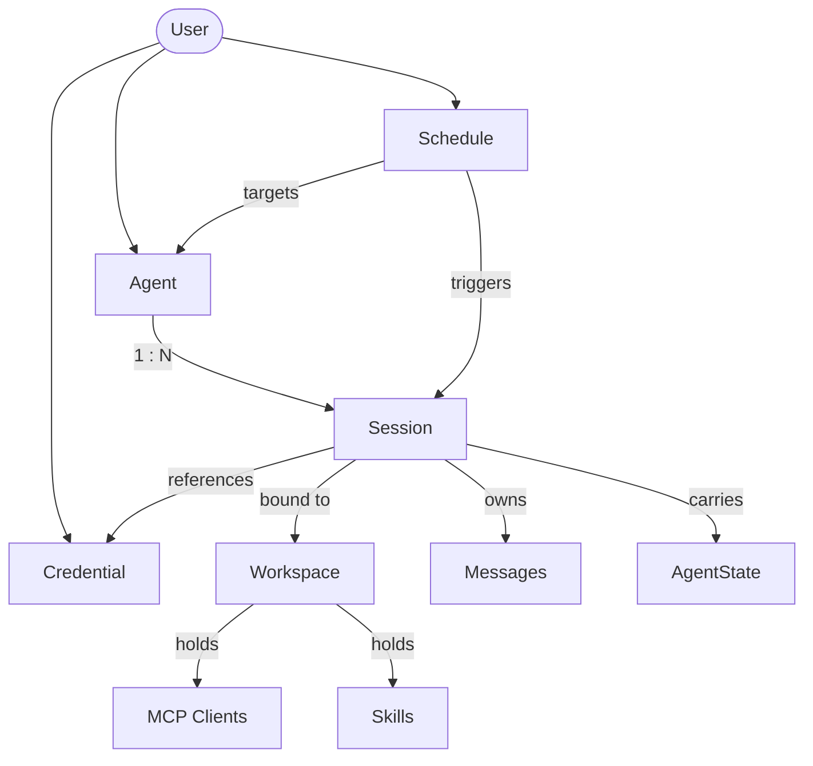
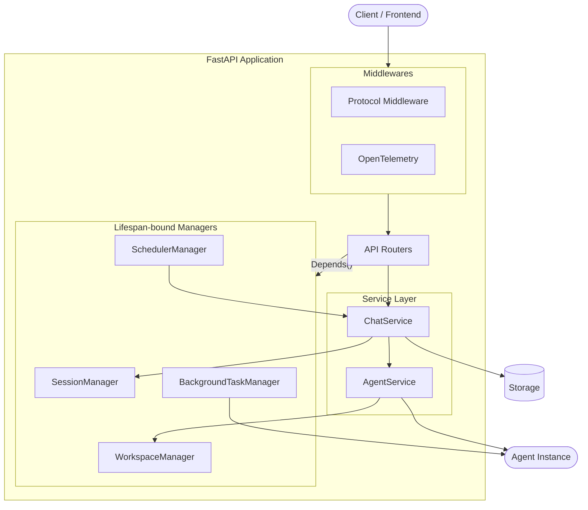

> ## Documentation Index
> Fetch the complete documentation index at: https://docs.agentscope.io/llms.txt
> Use this file to discover all available pages before exploring further.

# Agent Service

> 把 agent 部署为多租户、多会话的 HTTP 服务

Agent Service 是基于 FastAPI 的托管层，把 AgentScope 的 agent 转化为**多租户、多会话的 HTTP 服务**。它接管 agent *外围*的全部职责 —— 请求路由、按用户的资源生命周期、会话状态、持久化、调度，以及工具调用的卸载，让基于 [`Agent`](/zh/v2/building-blocks/agent) 编写的代码无需重写即可承接生产流量。

它的特点：

* **生产级在线 agent 骨架** —— agent 运行、后台任务、调度，以及 tool / MCP / skill / workspace 生命周期端到端纳管，会话事件流可扇出给多个订阅者，重连时还能从缓冲区中重放历史。
* **Schema 驱动的前端** —— credential 公开 JSON schema，model 暴露声明式卡片（输入 / 输出类型、上下文长度、参数 schema），前端无需绑死特定 provider 的代码即可渲染表单与能力标签。
* **天然多租户** —— credential、agent、session、schedule、message 都归属于请求的 `user_id`，所有权在路由层强制；一份部署即可服务多用户，无需为每个租户单独编写代码路径。
* **模块化、可扩展** —— 鉴权、聊天协议、workspace 隔离策略、存储后端，以及 model provider 与 credential 类型集合，全部在边界处开放，可在不动框架代码的前提下替换。

它**不**包含用户鉴权、前端、托管运行时 —— Agent Service 是部署在你自己鉴权网关之后、把 AgentScope agent 暴露给用户的中间层。Agent 业务逻辑、model provider、tool 实现仍由开发者掌握；Service 解决在规模化场景下托管它们所需的基础设施问题。

### 能力概览

| 能力            | 说明                                                 |
| ------------- | -------------------------------------------------- |
| 流式聊天          | 通过 SSE 实时推送 `AgentEvent` 对象                        |
| 会话管理          | 持久化会话，跨请求序列化状态                                     |
| 会话回放          | 后接入的客户端可通过缓冲重放接收完整事件历史                             |
| 后台任务卸载        | 长耗时工具调用切到后台执行，结果自动回注                               |
| Cron 调度       | 按时间触发 agent 执行，支持有状态或无状态 session                   |
| Credential 管理 | 安全存储与读取 model provider 的 API key                   |
| 协议适配          | 通过 middleware 转换为外部协议（AG-UI、A2A 等）                 |
| Workspace 管理  | 可插拔的 workspace 隔离策略（内置：按 agent；可扩展为按 session 或按用户） |

也可以把内置的 middleware、manager、依赖、storage 实现当作积木，组装出贴合自身基础设施的全自定义服务。

<Note>
  Service **不**自带用户鉴权系统。它提供 `X-User-ID` header 占位依赖，由开发者替换为自己的鉴权 middleware（JWT、OAuth、session token 等）。
</Note>

## 资源模型

Agent Service 中的每次操作都归属于从请求中解析出的 `user_id`。在该边界之下，service 管理六类资源，它们之间的关系决定了 REST API 的形态与运行时行为：



先理解这张图，REST API 就基本无需额外解释 —— 多数端点只是为已认证用户对其中一种资源做创建、列表或修改。

### User

Agent Service 自身不建模用户系统。`user_id` 是通过 `get_current_user_id` 依赖解析出的不透明租户标识 —— 替换该依赖即可对接任何身份系统（JWT、OAuth2、session cookie、SSO、API token）。详见[用户鉴权](#用户鉴权)。

### Credential

Credential 是某个 model provider（DashScope、OpenAI、Anthropic、Ollama 等）的连接配置 —— 一个 API key 加上 provider 特有的设置。同一用户可以为同一 provider 注册多份 credential —— LLM、TTS、Realtime 服务各用一份，或个人 key 与团队 key 并存 —— 并在多个 agent 与 session 之间复用同一份 credential，让 key 轮换只在一个地方发生。

新增 provider 的方式是继承 `CredentialBase` 并通过 `create_app(extra_credentials=[...])` 注册；客户端无需额外代码即可使用。

### Agent

Agent 记录描述 agent 是谁 —— 展示名、定义角色的 system prompt，以及上下文管理与 ReAct 循环的运行时配置。同一个 agent 可以在多个 session 中由不同 LLM 驱动：身份属于 agent，模型与运行时状态属于 session。

### Workspace

Workspace 是 agent 的运行时环境 —— 一个类文件系统的工作区，统一聚合可用的 tool、MCP、skill，并提供存放压缩上下文以支持 agentic search 的位置。实现可以是本地文件系统（`LocalWorkspace`），也可以是沙箱（`DockerWorkspace`、`E2BWorkspace`）；`WorkspaceManager` 决定 workspace 如何映射到 user、agent 与 session —— 按 user、按 agent（内置默认）、按 session 隔离都是合法策略。

### Session

Session 是用户与 agent 之间一次正在进行的会话。它承载：

* **Agent state** —— 工作记忆、未完成的 reply、permission context；每轮结束后持久化。
* **消息记录** —— 持久化的用户 / 助手往来，前端基于此渲染；与每轮重新组装的模型上下文窗口不同。
* **LLM 配置** —— provider、model、参数及调用所用的 credential。由于该配置随 session 走，同一 agent 可以在不同 session 中跑不同模型。
* **Permission level** —— 限定 agent 可调用的 tool 范围。

### Schedule

Schedule 按 cron 表达式触发 agent。每次触发都在一个 session 内运行 —— 可以每次新建（无状态），也可以复用以让上下文跨次累积（有状态）。Schedule 持久化保存，可在服务重启后恢复。

<Tip>
  要记住的形态：**agent 是可复用的模板，session 是运行时状态的承载单位**，模型绑定在 session 上。
</Tip>

## 快速上手

跑起一个 service 至少需要一个 storage 后端与一个 workspace manager。下面的示例在 8000 端口启动一个由 Redis 支撑的 service —— 选择匹配 agent 工具执行位置的 workspace 后端即可。

<CodeGroup>
  ```python 本地文件系统 theme={null}
  import uvicorn
  from agentscope.app import create_app, RedisStorage, LocalWorkspaceManager

  # Agent、session、credential、message、schedule 的持久化层。
  # 连接池在应用启动时打开、关闭时关闭。
  storage = RedisStorage(host="localhost", port=6379)

  # Workspace 生命周期 —— 工作目录、MCP client、skill。
  # 内置 manager 按 agent 隔离：同一 agent 的所有 session 共享一个 workspace。
  # 空闲 workspace 经过 `ttl` 秒后被淘汰。
  workspace_manager = LocalWorkspaceManager(
      basedir="/data/workspaces",
      ttl=3600.0,
  )

  app = create_app(
      storage=storage,
      workspace_manager=workspace_manager,
  )

  uvicorn.run(app, host="0.0.0.0", port=8000)
  ```

  ```python Docker 沙箱 theme={null}
  import uvicorn
  from agentscope.app import create_app, RedisStorage
  from agentscope.app._manager import DockerWorkspaceManager

  # Agent、session、credential、message、schedule 的持久化层。
  storage = RedisStorage(host="localhost", port=6379)

  # 每个 workspace 跑在独立的本地 Docker 容器中实现隔离。
  # 按用户 / agent 划分的宿主工作目录位于 `basedir` 下，挂载进各容器。
  workspace_manager = DockerWorkspaceManager(basedir="/data/docker-workspaces")

  app = create_app(storage=storage, workspace_manager=workspace_manager)
  uvicorn.run(app, host="0.0.0.0", port=8000)
  ```

  ```python E2B theme={null}
  import uvicorn
  from agentscope.app import create_app, RedisStorage
  from agentscope.app._manager import E2BWorkspaceManager

  # Agent、session、credential、message、schedule 的持久化层。
  storage = RedisStorage(host="localhost", port=6379)

  # 每个 workspace 跑在远端 E2B 云沙箱中。
  # 通过 `api_key` 显式传入，或设置环境变量 `E2B_API_KEY`。
  workspace_manager = E2BWorkspaceManager()

  app = create_app(storage=storage, workspace_manager=workspace_manager)
  uvicorn.run(app, host="0.0.0.0", port=8000)
  ```
</CodeGroup>

### create\_app 参数

<ParamField path="storage" type="StorageBase" required>
  持久化 agent、session、credential、message、schedule 的 storage 后端。其生命周期（`__aenter__` / `__aexit__`）由应用 lifespan 管理。
</ParamField>

<ParamField path="workspace_manager" type="WorkspaceManagerBase | None" default="None">
  以 TTL 缓存方式管理 workspace（文件存储、MCP server、skill）。内置 `LocalWorkspaceManager` 按 agent 隔离；其他策略见 [Workspace 实现与隔离](#workspace-实现与隔离)。
</ParamField>

<ParamField path="extra_credentials" type="list[Type[CredentialBase]] | None" default="None">
  额外注册的 credential 类型。每个类在应用启动前被注入 `CredentialFactory`。
</ParamField>

<ParamField path="extra_middlewares" type="list[Middleware] | None" default="None">
  额外的 ASGI middleware（例如协议适配器、CORS、鉴权）。
</ParamField>

<ParamField path="extra_agent_middlewares" type="AgentMiddlewareFactory | None" default="None">
  异步工厂 `(user_id, agent_id, session_id) -> Awaitable[list[MiddlewareBase]]`，在每次组装 agent（即每轮 chat 或每次 schedule 触发）时被调用一次。返回的 middleware 会传给 agent，可用于产出按用户 / 会话区分的 middleware，比如审计日志、租户隔离或自定义鉴权逻辑。
</ParamField>

<ParamField path="extra_agent_tools" type="AgentToolFactory | None" default="None">
  异步工厂 `(user_id, agent_id, session_id) -> Awaitable[list[ToolBase]]`，在每次组装 agent 时被调用一次。返回的 tool 会与 workspace 中的 tool 一起合并到 toolkit 的 `"basic"` 分组里，便于按调用者动态决定可用工具（例如按租户接入、按用户使用各自 credential 的工具）。
</ParamField>

<ParamField path="title" type="str" default="AgentScope">
  OpenAPI 文档界面中显示的标题。
</ParamField>

<ParamField path="version" type="str" default="2.0.0">
  OpenAPI 文档界面中显示的 API 版本号。
</ParamField>

<Warning>
  默认的 `X-User-ID` header 不提供任何鉴权。生产部署前请替换为真实的鉴权方案 —— 见[用户鉴权](#用户鉴权)。
</Warning>

### 典型操作流程

服务启动后，按资源模型中定义的资源驱动它即可。下面是一次聊天会话通常走过的路径 —— 每一步是一两次 REST 调用。

<Steps>
  <Step title="创建 agent">
    注册 agent 身份 —— 展示名、system prompt 与运行时配置。同一 agent 可以在不同 model 下驱动多个 session。

    ```http theme={null}
    POST /agent
    ```
  </Step>

  <Step title="创建并配置 credential">
    通过 `GET /credential/schemas` 发现各 provider 的表单字段，再保存 API key。一份 credential 可以在多个 session 与 agent 中复用。

    ```http theme={null}
    GET  /credential/schemas
    POST /credential
    ```
  </Step>

  <Step title="创建 session 并选择 model">
    创建一个绑定到该 agent 的 session，并附上 model 配置 —— provider、model 名称、参数，以及调用所用的 credential。从此之后由 session 拥有运行时状态。

    ```http theme={null}
    POST /sessions
    ```
  </Step>

  <Step title="配置 MCP 与 skill（可选）">
    若 agent 需要超出内置范围的 tool，向 session 的 workspace 附加 MCP client 与 skill。

    ```http theme={null}
    POST /workspace/mcp
    POST /workspace/skill
    ```
  </Step>

  <Step title="开始聊天">
    向 `/chat` POST 一条用户 `Msg`，通过 SSE 接收 agent 事件流。后接入的客户端可以重连同一 session 并重放缓冲事件。

    ```http theme={null}
    POST /chat
    ```
  </Step>
</Steps>

携带 `X-User-ID` header 与单条用户消息的最小 chat 调用：

```bash theme={null}
curl -N -X POST http://localhost:8000/chat \
  -H "X-User-ID: alice" \
  -H "Content-Type: application/json" \
  -d '{
    "agent_id": "agent-xxx",
    "session_id": "session-xxx",
    "input": {
      "name": "alice",
      "role": "user",
      "content": [{"type": "text", "text": "Hello"}]
    }
  }'
```

对于**计划任务**，完成步骤 1 与 2 后创建一个指向 agent 的 schedule —— scheduler 会按你给定的 cron 表达式创建 session（有状态或无状态）并触发执行。无需调用 `/chat`；cron 触发时 agent 自动运行。

```http theme={null}
POST /schedule
```

## API 概览

Service 把资源模型中的资源暴露为 REST 端点，外加流式聊天端点。下表按类别分组；完整请求与响应结构由 service 的 OpenAPI 规格描述。

| 类别                 | 端点                                                                 | 说明                                                   |
| ------------------ | ------------------------------------------------------------------ | ---------------------------------------------------- |
| Chat               | `POST /chat`                                                       | 通过 SSE 流式推送某 session 的 agent 事件；支持回放与多订阅者扇出。         |
| Sessions           | `GET/POST/PATCH/DELETE /sessions`                                  | 创建与管理聊天 session，包括 model 绑定与 permission level。       |
| Messages           | `GET /sessions/{id}/messages`                                      | 分页拉取某 session 的消息记录。                                 |
| Agents             | `GET/POST/PATCH/DELETE /agent`                                     | 管理 agent 记录 —— 展示名、system prompt、运行时配置。              |
| Credentials        | `GET/POST/PATCH/DELETE /credential`                                | 各 provider 的 API key 与连接配置 CRUD。                     |
| Credential schemas | `GET /credential/schemas`                                          | 发现已注册的全部 credential 类型及其 JSON 参数 schema，用于表单渲染。      |
| Models             | `GET /model?provider=<name>`                                       | 列出某 provider 下的候选模型，附带声明式 `ModelCard`（能力与参数 schema）。 |
| Schedules          | `GET/POST/PATCH/DELETE /schedule`                                  | 管理 cron 触发的 agent 执行，有状态或无状态。                        |
| Background tasks   | `GET /background-tasks`                                            | 查看被卸载到后台的工具执行。                                       |
| Workspace MCPs     | `GET/POST /workspace/mcp`、`DELETE /workspace/mcp/{mcp_name}`       | 管理挂在 session workspace 上的 MCP client。                |
| Workspace skills   | `GET/POST /workspace/skill`、`DELETE /workspace/skill/{skill_name}` | 管理 session workspace 中可用的 skill。                     |

## 自定义

Service 在每个基础设施边界上都开放扩展。下面分节说明哪些是内置的，以及如何插入自己的实现。

### Agent 聊天协议

Chat 端点通过 SSE 输出 AgentScope 原生的 [`AgentEvent`](/zh/v2/building-blocks/message-and-event) 流。要让同一 agent 服务于不同前端协议，安装协议 middleware 拦截 SSE 流并改写每帧。

AgentScope 内置 `AGUIProtocolMiddleware` 适配 [AG-UI](https://docs.ag-ui.com/) 协议。通过 `extra_middlewares` 装载：

```python theme={null}
from fastapi.middleware import Middleware
from agentscope.app import create_app, AGUIProtocolMiddleware

app = create_app(
    storage=storage,
    extra_middlewares=[
        Middleware(AGUIProtocolMiddleware),
    ],
)
```

新增协议时，继承 `ProtocolMiddlewareBase` 并实现 `_convert_to_protocol`：

```python theme={null}
from agentscope.app import ProtocolMiddlewareBase
from agentscope.event import AgentEvent

class MyProtocolMiddleware(ProtocolMiddlewareBase):
    def _convert_to_protocol(self, event: AgentEvent) -> dict:
        # 把 AgentEvent 转换为目标协议的帧格式。
        return {"type": event.type, "data": event.model_dump()}
```

Middleware 自动拦截 chat 端点返回的 `StreamingResponse`，把每条 SSE 帧反序列化回 `AgentEvent`，调用 `_convert_to_protocol()` 生成目标格式后重新序列化。

### 用户鉴权

内置的 `get_current_user_id` 依赖从请求 header `X-User-ID` 中读取调用者身份 —— 这是占位实现，不是真正的鉴权。用自己的依赖覆盖即可对接任何身份系统。

JWT bearer token：

```python theme={null}
from fastapi import Header, HTTPException, status

async def get_current_user_id(
    authorization: str = Header(...),
) -> str:
    try:
        payload = decode_jwt(authorization.removeprefix("Bearer "))
        return payload["sub"]
    except InvalidTokenError:
        raise HTTPException(
            status_code=status.HTTP_401_UNAUTHORIZED,
            detail="Invalid authentication token.",
        )
```

OAuth2 password flow：

```python theme={null}
from fastapi import Depends, HTTPException, status
from fastapi.security import OAuth2PasswordBearer

oauth2_scheme = OAuth2PasswordBearer(tokenUrl="token")

async def get_current_user_id(token: str = Depends(oauth2_scheme)) -> str:
    user = await verify_oauth_token(token)
    if user is None:
        raise HTTPException(status_code=status.HTTP_401_UNAUTHORIZED)
    return user.id
```

通过 FastAPI 的依赖覆盖机制把自定义实现挂上去：

```python theme={null}
from agentscope.app._deps import get_current_user_id as default_dependency

app.dependency_overrides[default_dependency] = get_current_user_id
```

<Warning>
  默认的 `X-User-ID` header 不提供鉴权。生产部署前请始终替换为安全机制。
</Warning>

### Workspace 实现与隔离

可独立配置两条正交维度：

* **Workspace 后端** —— agent 实际运行所在的运行时环境。内置实现包括 `LocalWorkspace`、`DockerWorkspace`、`E2BWorkspace`。新增后端实现 workspace 接口即可，可包装容器镜像、沙箱或远端虚拟机。
* **隔离策略** —— workspace 如何映射到 user、agent、session。内置 `LocalWorkspaceManager` 以 `agent_id` 为键：同一 agent 的所有 session 共享一个 workspace。要切换为按 user 或按 session 隔离，继承 `WorkspaceManagerBase` 并按自己的键策略覆写 `get_workspace`。

```python theme={null}
from agentscope.app import WorkspaceManagerBase
from agentscope.workspace import WorkspaceBase


class PerSessionWorkspaceManager(WorkspaceManagerBase):
    async def get_workspace(
        self,
        user_id: str,
        agent_id: str,
        session_id: str,
        workspace_id: str,
    ) -> WorkspaceBase:
        # 取出已初始化的 workspace；按 session_id 作键以实现按 session 隔离。
        ...

    async def create_workspace(
        self,
        user_id: str,
        agent_id: str,
        session_id: str,
    ) -> WorkspaceBase:
        # 分配新的 workspace 并写入缓存。
        ...

    async def close(self, workspace_id: str) -> None:
        # 关闭并淘汰单个 workspace。
        ...

    async def close_all(self) -> None:
        # 关闭全部缓存中的 workspace；应用关闭时调用。
        ...
```

### API credential

新增 credential 类型由两类组成：一个 `CredentialBase` 子类负责描述连接配置（并发布 JSON schema 用于表单渲染），一个 `ChatModelBase` 子类实现针对该 provider API 的流式聊天协议。Credential 类是入口 —— 它告诉 service 该实例化哪个 chat model 类。

```python theme={null}
from agentscope.credential import CredentialBase
from agentscope.model import ChatModelBase

class MyProviderChatModel(ChatModelBase):
    # 针对 provider API 实现流式聊天接口。
    ...

class MyProviderCredential(CredentialBase):
    api_key: str
    endpoint: str = "https://api.my-provider.com"

    @classmethod
    def get_chat_model_class(cls):
        return MyProviderChatModel
```

把 credential 类注册到 app 上，客户端立即可用：

```python theme={null}
app = create_app(
    storage=storage,
    extra_credentials=[MyProviderCredential],
)
```

Service 自动通过 `GET /credential/schemas` 暴露该 credential 的 JSON schema，`GET /model?provider=<name>` 路由到 `get_chat_model_class()` 返回的 chat model 类。

### Provider 模型

`GET /model?provider=<name>` 返回的模型列表由 `ModelCard` 实例构成 —— 这是声明式元数据记录，告诉前端如何展示每个模型、哪些请求参数合法。每个 chat model 通过 `list_models()` 暴露自己的目录，默认从 provider 模型目录下的 YAML 文件中读取 `ModelCard` 项；`ModelCard.from_yaml()` 解析每份 YAML，并把其中的 overrides 合并进 chat model 参数类提供的基础参数 schema。

ModelCard 包含以下字段：

| 字段                     | 说明                                                       |
| ---------------------- | -------------------------------------------------------- |
| `name`                 | provider 侧的模型标识。                                         |
| `label`                | UI 中显示的名称。                                               |
| `status`               | `active`、`deprecated`、`sunset` 之一。                       |
| `deprecated_at`        | 弃用时间戳，如有。                                                |
| `input_types`          | 模型接收的 MIME 类型（例如 `text/plain`、`image/png`、`video/mp4`）。  |
| `output_types`         | 模型输出的 MIME 类型（例如 `text/plain`、`application/x-thinking`）。 |
| `context_size`         | 上下文窗口的最大 token 数。                                        |
| `output_size`          | 最大输出 token 数。                                            |
| `parameter_schema`     | 请求参数的 JSON schema，自动与各模型 overrides 合并。                   |
| `parameters_overrides` | 叠加在基础参数 schema 之上的各模型差异。                                 |

下面的 YAML 示例描述一个接受文本、图像、视频，并输出文本与思考链路的多模态模型：

```yaml qwen3.6-plus.yaml theme={null}
name: qwen3.6-plus
label: Qwen3.6-Plus
status: active

input_types:
  - text/plain
  - application/x-thinking
  - image/bmp
  - image/jpeg
  - image/png
  - image/tiff
  - image/webp
  - image/heic
  - video/mp4

output_types:
  - text/plain
  - application/x-thinking

context_size: 1000000
output_size: 65536

parameter_overrides:
  max_tokens: {"maximum": 65536}
```

要在已有 provider 下新增模型，把 YAML 文件丢进 provider 模型目录即可 —— loader 会自动拾取，新条目会出现在 `GET /model?provider=<name>` 中。

### 存储后端

`StorageBase` 抽象类定义了 agent、session、credential、message、schedule 的持久化契约。AgentScope 内置 `RedisStorage` 实现：

```python theme={null}
from agentscope.app import RedisStorage

storage = RedisStorage(
    host="localhost",
    port=6379,
    db=0,
    password="your-password",
)
```

要换用其他数据库，实现同一接口即可：

```python theme={null}
from agentscope.app.storage import StorageBase


class PostgresStorage(StorageBase):
    async def __aenter__(self):
        # 打开连接池。
        ...

    async def __aexit__(self, exc_type, exc_val, exc_tb):
        # 关闭连接池。
        ...

    # 为每类记录实现 CRUD 方法：
    # agent、session、credential、message、schedule。
    ...

app = create_app(storage=PostgresStorage(dsn="postgresql://..."))
```

存储层管理的记录类型：

| 记录                 | 说明                                                        |
| ------------------ | --------------------------------------------------------- |
| `AgentRecord`      | Agent 配置（name、system prompt、context config、react config）。 |
| `SessionRecord`    | Session 状态，包含 `AgentState`、model 配置与 workspace 绑定。        |
| `CredentialRecord` | 加密保存的 model provider API key。                             |
| `ScheduleRecord`   | Cron schedule 定义及执行历史。                                    |
| `Msg`              | 按 session 持久化的消息，支持分页。                                    |

## Service 内部结构

如果开发者需要在 AgentScope 中扩展或嵌入 Agent Service 的实际实现，本节描述 FastAPI 应用是如何拼装起来的 —— 启动时跑哪些逻辑、由哪些 manager 持有运行时状态、middleware 在请求路径中的位置，以及 router 如何拿到这些资源。



### Lifespan

Lifespan context manager 每个进程仅运行一次。启动阶段打开 storage 连接池、实例化内存中的 manager、恢复持久化的 schedule 让其在重启后继续工作。关闭阶段取消进行中的 session 与后台任务、等待 scheduler 排空、关闭 storage 池。

### Manager

四个 manager 在 lifespan 期间被绑定到 FastAPI 应用状态上，所有请求共享：

| Manager                 | 职责                                                                    |
| ----------------------- | --------------------------------------------------------------------- |
| `SessionManager`        | 按 session 串行化（同一 `session_id` 同时只允许一次活动 run）、SSE 缓冲重放、多订阅者扇出。         |
| `BackgroundTaskManager` | `ToolOffloadMiddleware` 卸载到后台的工具调用注册表；执行完成后把结果回注 agent 上下文。           |
| `SchedulerManager`      | 基于 APScheduler 的 cron 执行；解析目标 session（有状态或无状态）并通过 `ChatService` 驱动运行。 |
| `WorkspaceManager`      | Workspace 生命周期与 TTL 缓存；隔离键（按 agent、按 user、按 session）由子类决定。            |

### Middleware

ASGI middleware 包裹每次请求。实际场景中常见两类 ——**协议 middleware**（例如 `AGUIProtocolMiddleware`）拦截 chat 端点的 SSE 响应并把每帧改写为目标协议；**可观测性 middleware**（例如 OpenTelemetry tracing）通过 `extra_middlewares` 不加修改地装入。

### 依赖

Router 通过 FastAPI 的 `Depends()` 拿到应用状态。标准注入项如下：

| 依赖                            | 返回                                      |
| ----------------------------- | --------------------------------------- |
| `get_current_user_id`         | 调用者的 user id —— 可被覆盖以对接任意鉴权系统。          |
| `get_storage`                 | 绑定在 app 上的 `StorageBase` 实例。            |
| `get_session_manager`         | 由 lifespan 绑定的 `SessionManager`。        |
| `get_workspace_manager`       | 由 lifespan 绑定的 `WorkspaceManager`。      |
| `get_background_task_manager` | 由 lifespan 绑定的 `BackgroundTaskManager`。 |
| `get_scheduler_manager`       | 由 lifespan 绑定的 `SchedulerManager`。      |

## 延伸阅读

<CardGroup cols={2}>
  <Card title="Agent" icon="robot" href="/zh/v2/building-blocks/agent">
    Agent 抽象与 ReAct 循环
  </Card>

  <Card title="Message & Event" icon="envelope" href="/zh/v2/building-blocks/message-and-event">
    事件流与消息重建
  </Card>

  <Card title="Tool" icon="wrench" href="/zh/v2/building-blocks/tool">
    内置与自定义 tool，包括外部执行
  </Card>

  <Card title="Context" icon="database" href="/zh/v2/building-blocks/context">
    上下文压缩与 workspace offloading
  </Card>
</CardGroup>
